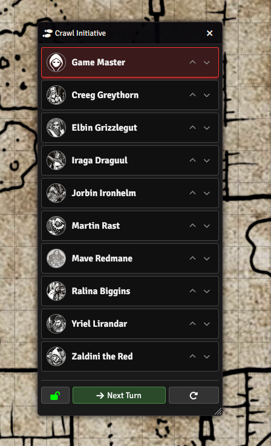

# Shadowdark Crawl Initiative Tracker

A dedicated turn-tracking module for **Shadowdark RPG** in Foundry VTT. This module helps Game Masters manage "Crawl Mode" turns, ensuring orderly exploration and movement.

## Features

- **Dedicated Initiative List**: Automatically populates with all Player characters and the GM.
- **Turn Management**: Simple "Next Turn" button for the GM to cycle through participants.
- **Movement Lock**: optionally prevent tokens from moving unless it is their turn (GM bypasses this).
- **Drag-and-Drop Reordering**: *Planned feature (currently uses Up/Down buttons).*
- **Auto-Sync**: Automatically updates participant names and images if they change on the actor.
- **State Persistence**: The tracker state (active turn, participant order) is saved to the world settings and persists across reloads.

## Installation

1.  Copy the module URL or search for "Shadowdark Crawl Initiative Tracker" in the Foundry VTT module browser.
2.  Click **Install**.
3.  Enable the module in your world's **Manage Modules** settings.

## Usage

1.  **Open the Tracker**:
    -   Navigate to the **Token Controls** (left sidebar, token icon).
    -   Click the **Toggle Crawl Tracker** button (shoe prints icon).

2.  **Managing Turns (GM Only)**:
    -   **Next Turn**: Click the "Next Turn" button at the bottom to advance initiative.
    -   **Reorder**: Use the `^` and `v` arrows next to a participant to change their initiative order.
    -   **Lock/Unlock Movement**: Click the Lock icon (bottom left) to toggle movement restrictions. Green (closed lock) means movement is restricted to the active player. Open lock means free movement for all.
    -   **Reset**: Click the Refresh icon (bottom right) to reset the tracker to just the GM.

## Compatibility

-   **Foundry VTT**: v13+
-   **Shadowdark RPG System**: v0.10.0+

## Feedback & Support

Please report bugs or feature requests on the [GitHub Issues](https://github.com/fynflood/Shadowdark-Crawl-Tracker/issues) page.
